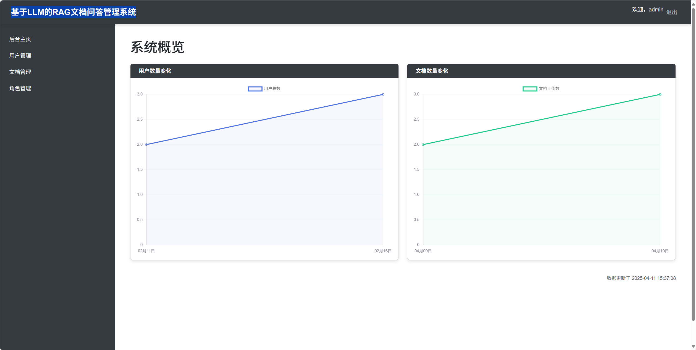
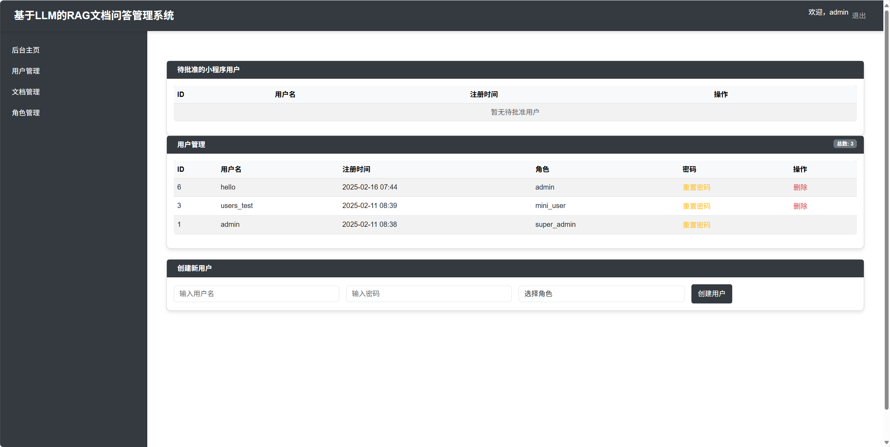
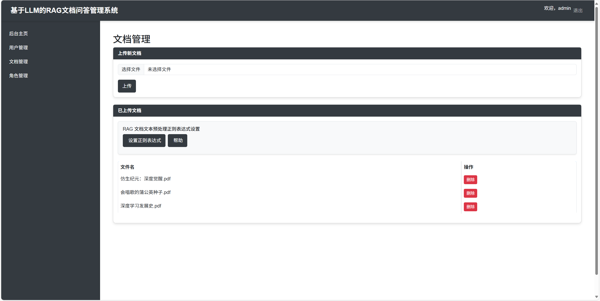
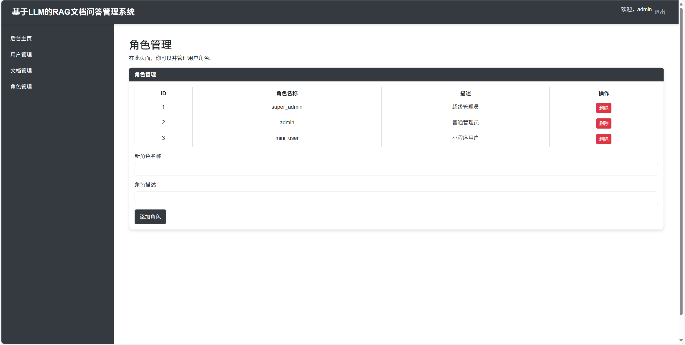
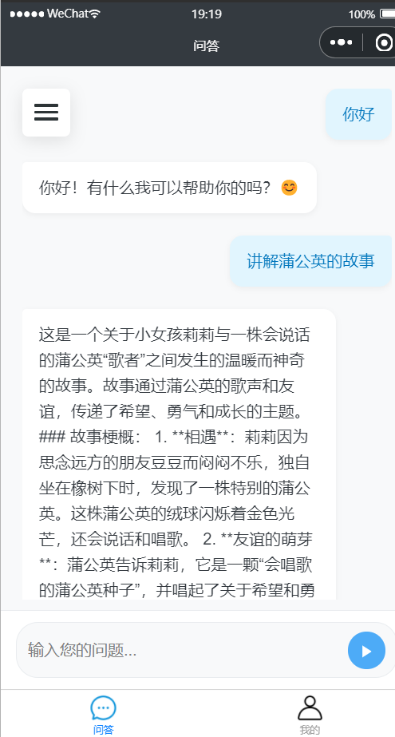
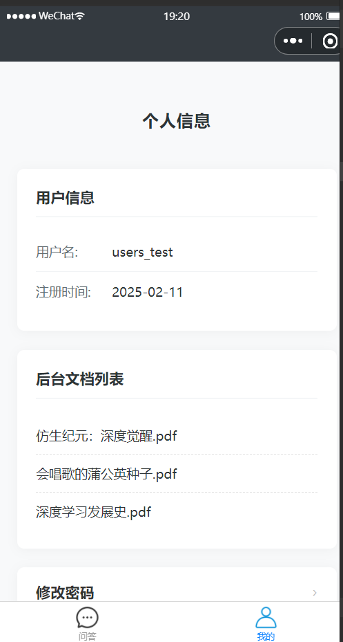
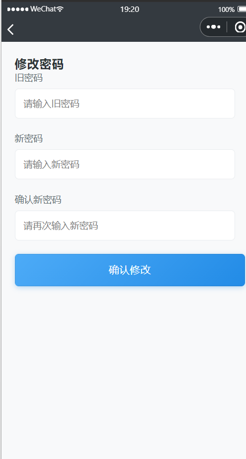

# 基于LLM的RAG文档问答系统

##  系统框架图

## 系统展示

1. 基于LLM的RAG文档问答管理系统

2. 小程序展示

  
  
  

## 使用

1. 在Config.py中配置SECRET_KEY、EMBEDDING_MODEL_PATH、DEEPSEEK_API_KEY
2. 在终端运行python app.py
3. 默认后台管理系统的账号：admin，密码：admin123；小程序账号：users_test，密码：Temp@1234
