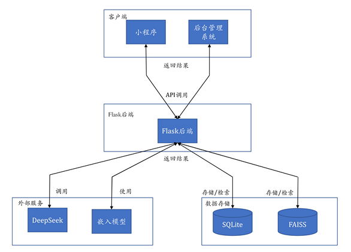

# 基于大语言模型的RAG文档问答系统
```
QASystem/
├── documents/ # 存放上传文档
├── migrations/ # 数据库迁移目录
├── static/ # 静态文件目录
│ ├── css/
│ 	├── style.css # 登录页等的CSS样式
│ └── images/
│ 	└── login_bg.png # 登录页背景图
├── templates/ # Flask模板目录（HTML页面）
│ ├── admin_index.html
│ ├── base.html
│ ├── login.html
│ ├── manage_docs.html
│ ├── manage_roles.html
│ └── manage_users.html
├── vectorstore/ # 向量库
├── app.py # Flask主应用入口
├── config.py # 配置文件（如密钥、路径等）
├── model.py # 向量模型加载与管理
├── RAG_QA.py # RAG问答逻辑实现
├── text_process.py # 文本抽取与清洗
├── vector_manager.py # 向量库管理工具
└── database.db # SQLite数据库文件

QAwechatminiprogram/
├── icons/                         # 图标资源
│   └── …  
├── pages/                         # 页面文件夹
│   ├── agreement/                 # 服务协议页
│   │   ├── agreement.wxml
│   │   ├── agreement.wxss
│   │   ├── agreement.js
│   │   └── agreement.json
│   ├── login/                     # 登录页
│   │   ├── login.wxml
│   │   ├── login.wxss
│   │   ├── login.js
│   │   └── login.json
│   ├── modify_password/           # 修改密码页
│   │   ├── modify_password.wxml
│   │   ├── modify_password.wxss
│   │   ├── modify_password.js
│   │   └── modify_password.json
│   ├── profile/                   # “我的”页
│   │   ├── profile.wxml
│   │   ├── profile.wxss
│   │   ├── profile.js
│   │   └── profile.json
│   ├── qa/                        # 问答页
│   │   ├── qa.wxml
│   │   ├── qa.wxss
│   │   ├── qa.js
│   │   └── qa.json
│   └── register/                  # 注册页
│       ├── register.wxml
│       ├── register.wxss
│       ├── register.js
│       └── register.json
├── utils/                         # 工具函数
│   └── request.js                 # 封装的网络请求
├── app.js                         
├── app.json                      
├── project.config.json           
└── project.private.config.json   
```


##  系统框架图



## 系统展示

1. 基于大语言模型的RAG文档问答管理系统


2. 基于大语言模型的RAG文档问答助手

<div style="
  display: flex;
  flex-wrap: wrap;
  justify-content: center;
  align-items: flex-start;
  gap: 10px;
">
  
  
  
  
</div>


## 使用

1.  ```pip install -r requirements.txt```(安装依赖)
1. 在config.py中配置SECRET_KEY、JWT_SECRET_KEY、**EMBEDDING_MODEL_PATH(必须配置)**、**DEEPSEEK_API_KEY（必须配置）**
1. 在/QAwechatminiprogram/project.config.json路径下配置**appid(必须配置)**
2. 在终端运行```python app.py```
3. 默认后台管理系统的账号：admin，密码：admin123；小程序账号：users_test，密码：Temp@1234
